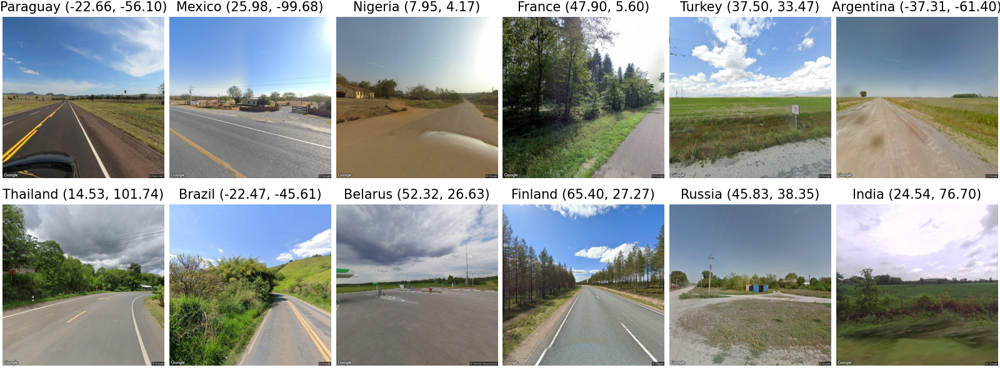
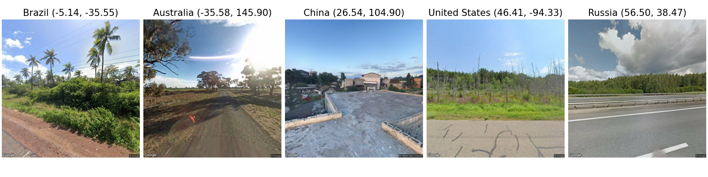
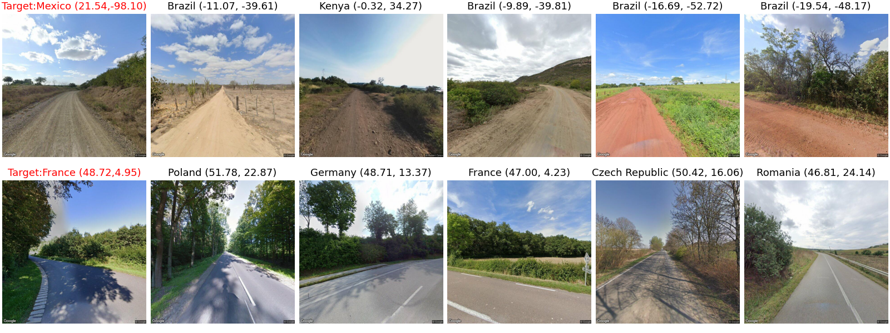

# LLMGeo
LLMGeo: Benchmarking Large Language Models on Image Geolocation In-the-wild

This dataset consists of images sourced from Google Maps, designed to evaluate Large Language Models (LLMs) for academic research, if you like to use it in commercial projects, please contact Google. 

## Benchmark
#### LLMs' accuracy results with different prompts before finetune

| Model                  | Basic | Must  | Tips  | S-5-shot | D-5-shot | S-5-shot-Rd | D-5-shot-Rd |
|------------------------|-------|-------|-------|----------|----------|-------------|-------------|
| GeoCLIP                | 0.258 | -     | -     | -        | -        | -           | -           |
| ChatGPT-4V             | 0.102 | 0.513 | 0.422 | -        | -        | -           | -           |
| Gemini                 | 0.666 | 0.660 | 0.670 | 0.741    | 0.736    | 0.737       | 0.746       |
| BLIP-2-2.7B            | 0.290 | 0.305 | 0.002 | -        | -        | -           | -           |
| BLIP-2-T5-XL           | 0.257 | 0.365 | 0.361 | -        | -        | -           | -           |
| Fuyu-8B                | 0.014 | 0.016 | 0.008 | -        | -        | -           | -           |
| ILM-VL-7B              | 0.182 | 0.301 | 0.327 | 0.000    | 0.016    | 0.024       | 0.015       |
| LLaVA1.5-7B            | 0.189 | 0.204 | 0.120 | 0.027    | 0.317    | 0.031       | 0.321       |
| LLaVA1.5-13B           | 0.165 | 0.185 | 0.049 | 0.032    | 0.310    | 0.035       | 0.312       |

#### Finetune results
| Model           | Basic ($\uparrow$)            | Must ($\uparrow$)            | Tips ($\uparrow$)            |
|-----------------|-------------------------------|------------------------------|------------------------------|
| ILM-VL-7B(T)    | 0.413 (+0.231)                | 0.436 (+0.135)               | 0.449 (+0.122)               |
| ILM-VL-7B(CT)   | 0.441 (+0.259)                | 0.443 (+0.142)               | 0.439 (+0.112)               |
| LLaVA-7B (T)    | 0.562 (+0.373)                | 0.561 (+0.357)               | 0.547 (+0.427)               |
| LLaVA-7B (CT)   | 0.557 (+0.368)                | 0.560 (+0.356)               | 0.548 (+0.428)               |
| LLaVA-13B (T)   | 0.567 (+0.402)                | 0.391 (+0.206)               | 0.342 (+0.293)               |
| LLaVA-13B (CT)  | 0.562 (+0.397)                | 0.385 (+0.200)               | 0.329 (+0.280)               |


## Dataset

#### Image Distribution
| Dataset               | H-0  | H-90 | H-180 | H-270 | Total | # of Countries |
|-----------------------|------|------|-------|-------|-------|----------------|
| Test                  | 250  | 250  | 250   | 250   | 1000  | 82             |
| Train                 | 618  | 600  | 600   | 600   | 2418  | 92             |
| Comprehensive Train   | 1609 | 1600 | 1599  | 1598  | 6408  | 115            |


#### Images
|  | 
|:--:| 
| *Samples from test set* |

|  | 
|:--:| 
| *Static few shots sample* |

|  | 
|:--:| 
| *Static few shots sample* |


### Reproduction
#### Baseline
```
cd src
python geo_clip.py
python chatgpt.py
python gemini.py
python blip2.py
python fuyu.py
python xcomposer.py

// before running this, you need to applied this PR https://github.com/haotian-liu/LLaVA/pull/1160
// or you have to adjust the code
python llava_engine.py checkout 
```
#### Finetune
To generate the data for fintuning, you can run `python data_loader.py`, but you may need to adjust the path to your abs path. Sample files are in `dataset/finetunes/`

And you need to adjust the finetuned_model path within `llava_engine.py` and `xcomposer.py` before running.

### Cite
If you can find our project is useful, please cite our paper

```
@misc{wang2024llmgeo,
      title={LLMGeo: Benchmarking Large Language Models on Image Geolocation In-the-wild}, 
      author={Zhiqiang Wang and Dejia Xu and Rana Muhammad Shahroz Khan and Yanbin Lin and Zhiwen Fan and Xingquan Zhu},
      year={2024},
      eprint={2405.20363},
      archivePrefix={arXiv},
      primaryClass={cs.CV}
}
```